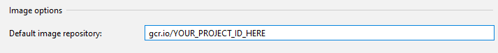

Trying out the kubernetes client-go to watch and cache pod labels

## Skaffold Notes

Make sure to configure a proper default image repository via `--default-repo` or the equivalent in your IDE, such as the following in IntelliJ:

